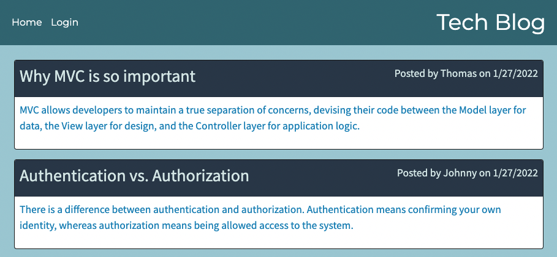

# Tech Blog
[](./LICENSE)
## Description
This app is a blogging site where users can post and comment. Built with Express, MySQL2, Sequelize, and handlebars.

## User Story
```
As a developer who writes about tech, I want a CMS-style blog site so that I can publish articles, blog posts, and my thoughts and opinions.
```

## Table of Contents
- [Installation](#installation)
- [Usage](#usage)
- [Link](#link)
- [License](#license)
- [Features](#features)
- [Tests](#tests)
- [Questions](#questions)

## Installation
- To get the app on your local machine:
  1. Click on the code button on the repo.
  2. Copy the HTTPS or SSH link.
  3. Run the command `git clone` with the copied HTTPS or SSH link.
- To get the app prepared to run:
  1. In your local repo, make a `.env` file and enter the follow text with your own credentials.
    ```
    DB_NAME=user_db
    DB_PASSWORD=YOUR PASSWORD HERE
    DB_USER=root
    SESSION_SECRET='YOUR OWN SECRET KEY HERE'
    ```
  2. In the terminal, run the command `npm i`, then run `mysql -u root -p`.
  3. After logging into MySQL, run the command `source db/schema.sql`, then run `quit`.
- If you would like seed data for testing, run the command `npm run seed`.

## Usage
The visual shows the app running on a local server.



Please click [here](https://youtu.be/PIIWdPOa4Cs) for a video demo.

## Deployed Link
https://andrewbyoo-tech-blog.herokuapp.com/

## License
This application is covered under the MIT license.

## Features
- Sign up and log in with created account in a later instance
- Make blog posts
- Comment on blog posts
- Edit and delete your own blog posts

## Tests
As shown in the video demo, the command `npm start` was run to start the app.

Once the server has started on a local server, a new user was created. Comments were made on blog posts on others posts and on a personal blog post that was created from the dashboard. The user was logged out and was able to log back in.

## Questions
To view more of my projects, you can visit my GitHub page at [andrewbyoo](https://github.com/andrewbyoo).
If you have questions, email me at [andrewbyoo@gmail.com](mailto:andrewbyoo@gmail.com).
